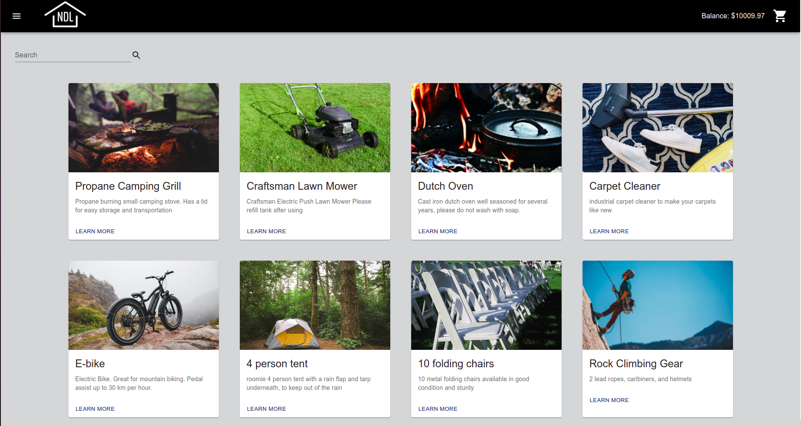
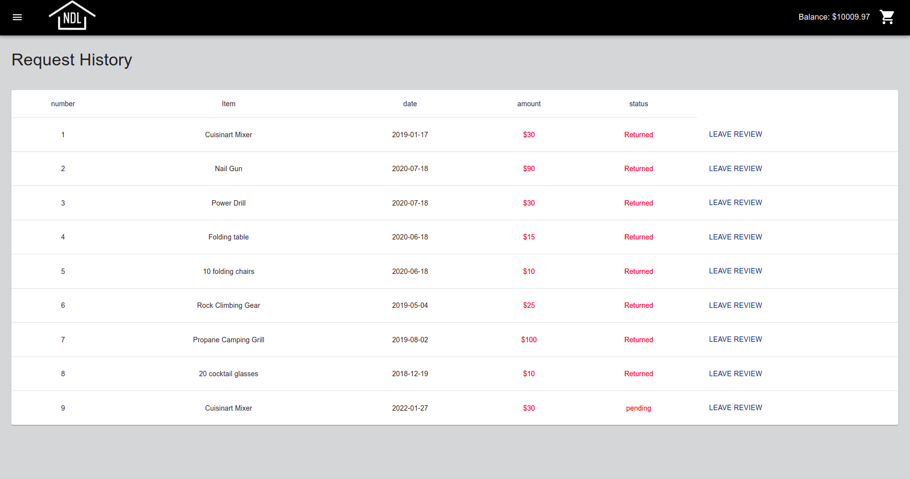

# Next Door Lenders 

### The Idea

In this time of rising housing and living costs, people are becoming less inclined to buy expensive equipment and housewares that they know will spend most of their time sitting in storage. In high density cities such as Vancouver, living spaces are increasingly being designed with little to no storage space. Along with a growing awareness of climate change and the environmental impact of over-consumption, many people are looking to new ways to share resources, tools, and even furniture. The bottom line: We have too much stuff! 

Next Door Lenders helps users both find and share stuff around their neighborhood and beyond.

### The Tech Stack

This project has two main folders: api and client. They each have separate dependencies and separate package.json files. The API folder runs the database and router. The client runs everything front end.

The API is powered by express. It uses pg-native to incorporate our psql database.

The Client was built using create-react app. It includes react router for easy page to page navigation and Material UI for the css framework.

### Getting Started

- Step 1: From the API file: run npm install it should install the following dependencies
  - @vonage/server-sdk
  - bindings
  - chalk
  - cookie-session
  - cors
  - dependencies
  - dotenv
  - express
  - pg
  - pg-native
- Step 2: From the API file: create your local database and put credentials in your .env file
- Step 3: From the API file: npm run db:reset
- Step 4: From the API file: npm start (this concludes getting your api running)
- Step 5: From the Client file: run npm install it should install the following dependencies
  - @date-io/dayjs
  - @emotion/react
  - @emotion/styled
  - @mui/icons-material
  - @mui/lab
  - @mui/material
  - axios
  - create-react-app
  - dependencies
  - dom
  - react-dom
  - react-router
  - react-router-dom
  - react-scripts
  - web-vitals
- Step 6: From the Client file: npm start (this will get your app running)

### The Final Product

